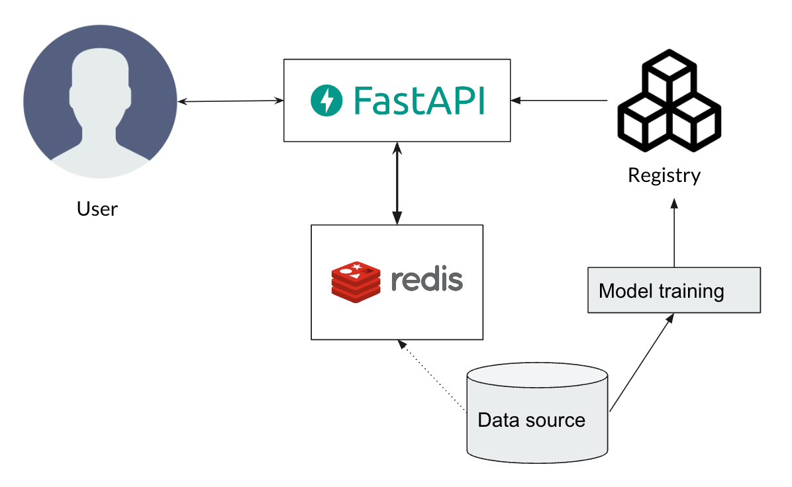
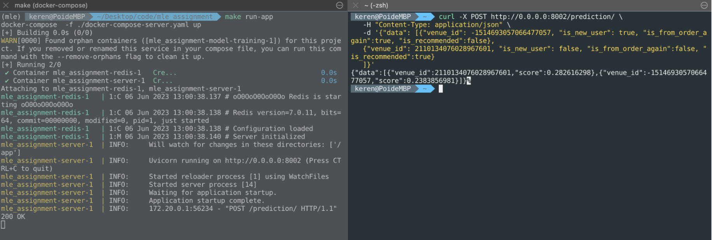

# Real-time webserver + Redis for venues ranking

In this chapter, to improve my MLOPs understanding and improve my skill, I build a **real-time web server** for venues ranking.
Plus I use a **cache** to speed up the data extraction, which is used very often in real work.  
On top of that, I also train a simple ranking model to get the model. And a model training pipeline is included as well.  

It is great to run this project into two containers using `Docker-compose`, and we can learn a lot about how to define and manage the connect and interaction between them.  

You can see the overall architecture here:



## TODO
- Deployment locally on [minikube](https://minikube.sigs.k8s.io/docs/)  


## Installation

I choose `Python 3.10.6` as the development environment.  
The based image of the selected [Dockerfile](./Dockerfile) is `python:3.10.6-slim`.  

If you want to run it using Docker, you can just jump to `Usage` session.  
If you want to run it locally, check out the following section by using `pyenv` + `Poetry`

---

### Create a Python virtual env with *pyenv*
Here I use a Python version management tool: [pyenv](https://github.com/pyenv/pyenv).  
As a user, you can easily install and switch between different versions of Python.  
You can install Pyenv following [this link](https://github.com/pyenv/pyenv#getting-pyenv) and Pyenv-virtualenv following [this link](https://github.com/pyenv/pyenv-virtualenv)

Then we can create a Python virtual environment as follows:
1. Install a specific verion of Python:
```
    # Install Python 3.10.6 
    pyenv install 3.10.6
```
**[deprecated] as `Poetry` provides virtual environment**  
~~2. Create a virtual environment, with Python verison and customized name:~~
```
    # pyenv virtualenv <python_version> <environment_name>
    pyenv virtualenv 3.10.6 mle_assignment
```
~~3. After installation, you will be able to activate and deactivate the environment:~~
```
    # Activate: pyenv activate <environment_name>
    pyenv activate mle_assignment
    # Deactivate
    source deactivate
```
~~Activating your env to maintain a stable development environment.~~

### Use Poetry to maintain development management

[Poetry](https://python-poetry.org/) is a great tool for Python packaging and dependency management, as a user you can easily reproduce the development environment and update the packages when possible, especially when it is already being used - which is the case for this project.

You can install it following [this link](https://python-poetry.org/docs/#installation), after setting the Python version as mentioned above.

And then, you just need:
`poetry install` and wait for the environment and dependency being set. 

---
## Usage

Install dependencies locally:
```
make install-dependency
``` 

Run Python linter locally:
```
make linter
``` 

Run Python formatter locally:
```
make formatter
``` 

Run Python type checker locally:
```
make checker
``` 

Run Jupyter lab locally:
```
make jupyter
``` 

Run the model-training job:
```
make model-training
``` 

Spin up the server:
```
make run-app
``` 

Rebuild the server(once you modify the code):
```
make rebuild-app
``` 

The endpoint for the prediction is `http://0.0.0.0:8002/prediction/`.  
You can call the endpoint by running the follow command as an example in your terminal:
```
curl -X POST http://0.0.0.0:8002/prediction/ \
   -H "Content-Type: application/json" \
   -d '{"data": 
   [{"venue_id": -1514693057066477057, "is_new_user": true, "is_from_order_again":true, "is_recommended":false},
   {"venue_id": 2110134076028967601, "is_new_user": false, "is_from_order_again":false, "is_recommended":true}
   ]}'
```

You will receive:
```
{"data":
[
{"venue_id":2110134076028967601,"score":0.282616298},
{"venue_id":-1514693057066477057,"score":0.2383856981}
]
}
```

For example:


You can also check generated API documentation here: [http://0.0.0.0:8002/docs](http://0.0.0.0:8002/docs)

## Folder structure

```
.
├── Dockerfile
├── Makefile
├── README.md
├── docker-compose-model-training.yaml
├── docker-compose-server.yaml
├── pyproject.toml
├── poetry.lock
└── src
    ├── __init__.py
    ├── data
    │   ├── sessions.csv
    │   └── venues.csv
    ├── registry
    │   ├── model_1.0_060423_174140
    │   │   ├── model.joblib
    │   │   └── model_metrics.json
    │   └── model_1.0_060523_102618
    │       ├── model.joblib
    │       └── model_metrics.json
    ├── data.py
    ├── main.py
    ├── model.py

```
`Dockerfile`: Dockerfile of the of the server and model-training job.  
`Makefile`: Making life much easier to use shortcuts to do things.  
`docker-compose-model-training.yaml`: Docker compose file of model training job.
`docker-compose-server.yaml`: Docker compose file to spin up the RESTapi server and Redis cache.  
`pyproject.toml`: Python project settings and configs file.  
`poetry.lock`: Lock file of Poetry - a dependency management tool   

Folder `src`: Source folder of codes:  
    Folder `data`: Containing data for model training and Redis cache.  
    Folder `Register`: Containing model artfact and evaluation metric file.  
    `data.py`: Python file for data preprocessing.  
    `model.py`: Python file of the model class.  
    `main.py`: Python file for the RESTapi server.