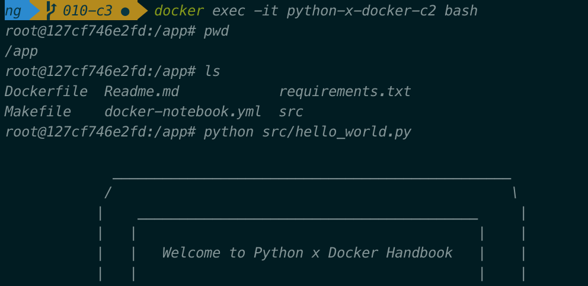

# How to develop your Python code interactively with Docker

In this chapter, we will see how to develop your Python code interactively with Docker,
by utilizing the **bind mounts**. 

Long story short, bind mounts allows your container to access some directories on your local machine, instead of keeping its own independent filesystem. 

This enables you to use the development environment set by Docker to develop your code and
can make sure that all the changes would be saved on your machine.

I will show an example of spinning up [JupyterLab](https://jupyterlab.readthedocs.io/en/stable/getting_started/overview.html) in a Docker container,
and then we can see a notebook we create will be saved on local machine.


We will go though the following steps:
1. Prepare code, dependencies and Dockerfile
2. Build the Docker image and start the container with a bind mount
3. Create a jupyter notebook and save it


## Prepare code, dependencies and Dockerfile

In the previous example, we walk through the Dockerfile line by line.  
Here I simplify a bit to focus on the key points.

The folder structure is presented as follows:
```
.
├── Dockerfile
├── Makefile
├── docker-notebook.yml
├── requirements.txt (Dependencies)
└── src (Python code folder)
    └── hello_world.py
```

Here is the Dockerfile:
```
FROM python:3.8.1-slim

LABEL Author="ZequnZ" Link="https://github.com/ZequnZ/python-x-docker-handbook"

WORKDIR  /app

COPY requirements.txt /app
RUN pip install --no-cache-dir -r requirements.txt

ENTRYPOINT [ "jupyter-lab", "--ip=0.0.0.0", "--port=8999", "--no-browser", "--allow-root" ]

```
We can see that we do not copy the `src` folder into the container.
Keep this in mind and we will see where the magic happens later.  
As the goal is to spin up JupyterLab, the command under `ENTRYPOINT` is changed accordingly, using the `port` 8999 of the container.

## Build the Docker image and start the container with a bind mount

First, we will need to build the Docker image from Dockerfile, with the following command:
```
docker build -t python-x-docker:c2 .
```

Starting container is slightly different this time. 
```
docker run --name python-x-docker-c2 -p 8998:8999 -v $(pwd)/:/app python-x-docker:c2 
```
We spin up the JupyterLab in the container and need to access it outside the container.
Therefore, we need to make the port 8999 of the container accessible to us as the host.

With the help of `-p 0.0.0.0:8998:8999`, we link the port 8998 of the host machine to the port 8999 of the container.
Accessing `http://0.0.0.0:8998/` is equivalent to accessing the `http://0.0.0.0:8999/` of the container.

Then we also need to set directories which can be shared with the container.
In other words, container will have the read and write permission to directories which are specified after `-v`.
Using `-v $(pwd)/:/app` we share all files under the current path with the container.

You can see a link in your terminal to open the jupyter lab.
For better explaining, in this example you will need to manually modify the port in the link from 8999 to 8998 in order to open it.
A better practice is using the same port nubmer like `-p 0.0.0.0:8999:8999` to make it more convenient.

To check if it works as expected, we can enter into the container to see its filesystem:
```
docker exec -it python-x-docker-c2 bash
```

Then, we can see:

Even though we do not copy everything(only the requirements.txt) in the Dockerfile,
we can still see files inside the container and run the `helloworld.py`!

### Create a jupyter notebook and save it

Now, you have a playaround supported by Docker and just create and save your jupyter notebook!

## One more thing...

I would like to introduce [Docker Compose](https://docs.docker.com/compose/) which a tool for 
defining and running multi-container Docker applications.
Here we will use it to spin up the container and we will see its power in the next chapter.

In order to use Docker Compose, we need to create a `yml` file listing the setup: 
```yml
version: "3.7"

services:
  notebook:
    build:
      context: ./
      dockerfile: Dockerfile

    volumes:
      - ./:/app

    ports:
      - "0.0.0.0:8998:8999"
```
In the `yml` file, we define a service called `notebook`, with the following setups: 
    - A Dockerfile used to build the image need to be specified under `build` instruction. 
    - The shared directories are defined under `volumns` instruction.
    - The ports of the host and the container are linked dunder `ports` instruction.

We can use the following command to spin up the notebook inside the container:
```
docker-compose  -f ./docker-notebook.yml up --build
``` 
A Docker image will be built based on the Dockerfile and then the container will be started.

You can apply the option `--no-build` once you have built the image, to save some time:
```
docker-compose  -f ./docker-notebook.yml up --no-build
``` 

Again, I add a [Makefile](./Makefile) to make life easier.
Check out the file to know how to utilize it.

In this chapter, we learn how to use Docker for interactly developing by using bind mounts and publishing a container's port to the host.
Other than jupyter-lab, you can run a web server in the container and make it accessible to the host.  
Also, we introduce Docker Compose to spin up the container.
However, Docker Compose is far more than this, next chapter - [The power of Docker Compose](../powerful-docker-compose), we will see how to utilize Docker to achieve something more inretesting. 
