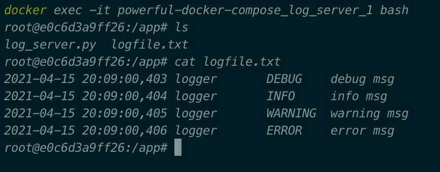

# The power of Docker Compose

In the chapter, we will see the power of Docker Compose, a tool that enable us to run multiple containers together. 
With Docker Compose, we not only can build up a multi-container application in customized structure, but also utilize as great components, such as database, search engine and many other useful tools.

I will show an example of running two containers, one as a log server, the other one execute a Python function to log something
Then we will be able to see the logs in the container of log server.

We will go through the following steps:
1. Prepare code and two Dockfiles
2. Prepare `yml` file and define the components
3. Spin up the application and see the result

